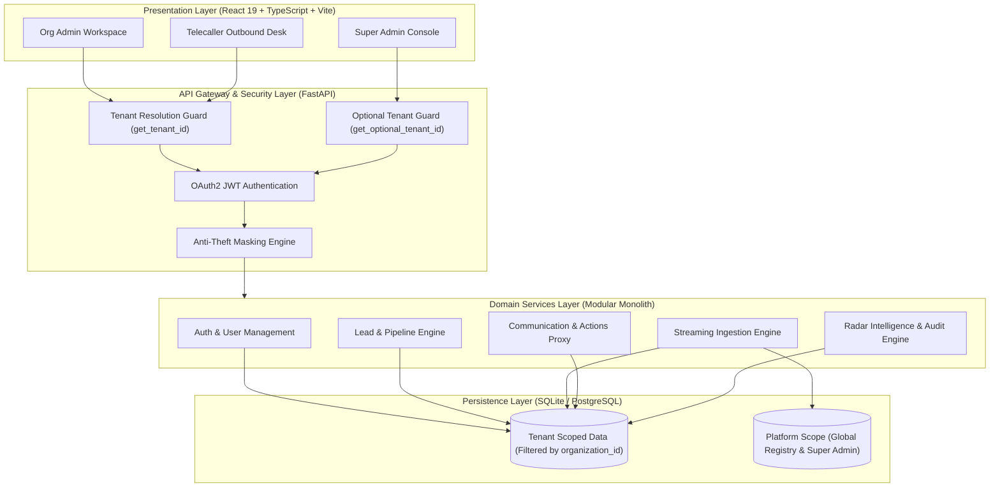
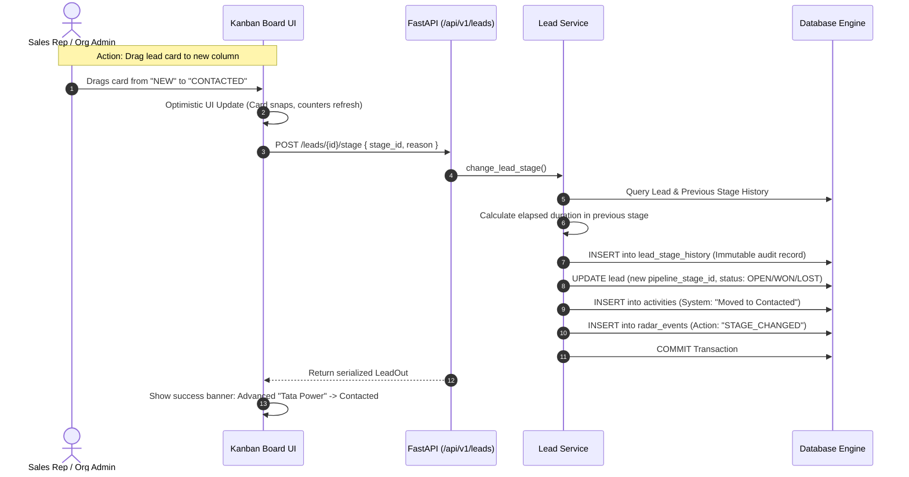
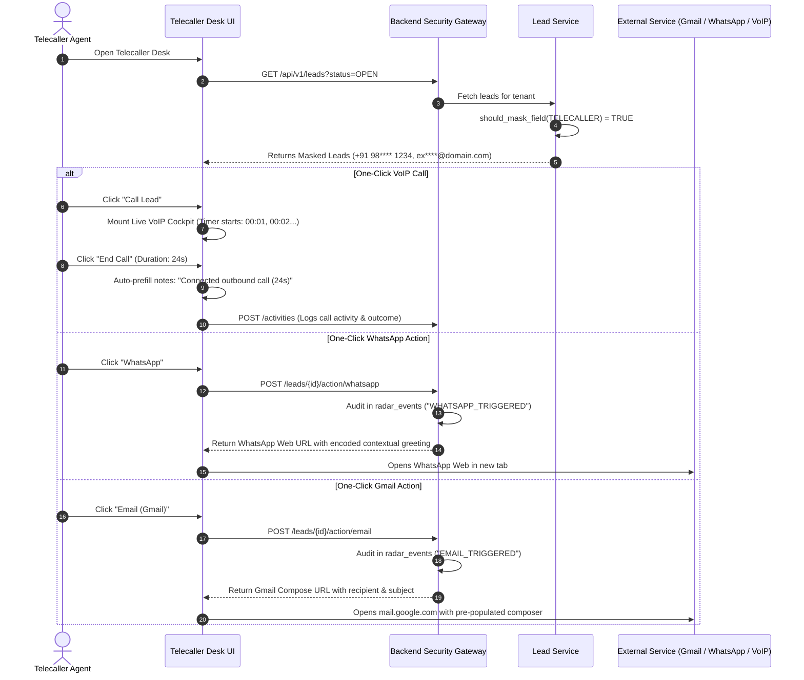
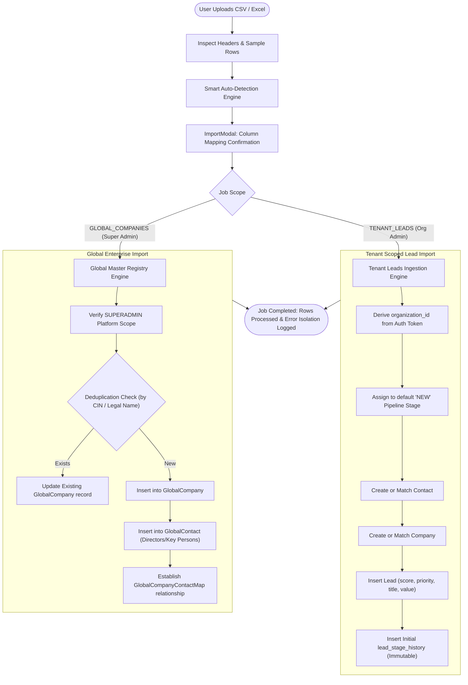
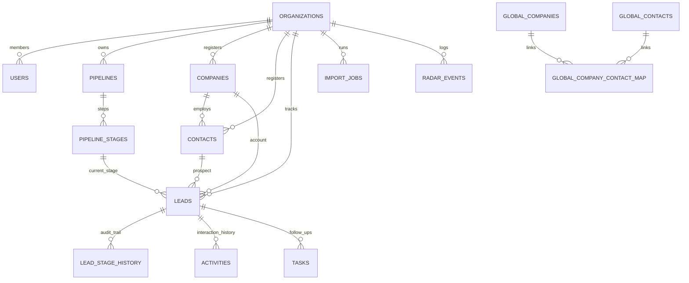

# JARVIS CRM — Master Architecture & System Flow Diagrams

This document contains visual diagrams mapping out the entire JARVIS CRM system, its modular monolith architecture, role-based workflows, and data pipelines. It is structured to be easy to understand and present.

---

## 1. High-Level System Architecture (10,000-Foot View)

The entire application runs as a **Modular Monolith** with strict domain boundaries, server-enforced multi-tenancy, and role-based access control.

---

## 2. Role-Based Navigation & Module Breakdown

JARVIS CRM delivers distinct, dedicated module workflows based on the user's authenticated persona:

```mermaid
graph TD
    User([Authenticated User]) --> CheckRole{User Role}

    %% SUPER ADMIN ROUTE
    CheckRole -->|"SUPERADMIN (Platform Level)"| SuperAdminModules["Super Admin Console"]
    subgraph SAModules["Super Admin Workspaces"]
        SuperAdminModules --> Mod_SA_Org["Organizations Console<br>• Tenant Workspaces<br>• Workspace Provisioning<br>• Subscription Tiers & KPIs"]
        SuperAdminModules --> Mod_SA_Audit["Platform Security Audit<br>• Cross-Tenant Audit Trail<br>• Action Type Filter<br>• Real-Time Security Log"]
        SuperAdminModules --> Mod_SA_Global["Global Database Registry<br>• 70,000+ Company Master<br>• Director / Contact Mapping<br>• Global Bulk Ingestion Wizard"]
    end

    %% ORG ADMIN ROUTE
    CheckRole -->|"ADMIN (Tenant Level)"| AdminModules["Org Admin Workspace"]
    subgraph OAModules["CRM Organization Modules"]
        AdminModules --> Mod_OA_Radar["Radar Insights<br>• Deal velocity metrics<br>• Stale lead warnings<br>• Revenue forecasting"]
        AdminModules --> Mod_OA_Kanban["Sales Pipeline Kanban<br>• Native Drag & Drop<br>• Dynamic stage totals<br>• Real-time search & filters"]
        AdminModules --> Mod_OA_Leads["Leads & Contacts Directory<br>• Single '+ Add Lead' manual entry<br>• 360° Lead Detail Drawer<br>• Full contact info unmasked"]
        AdminModules --> Mod_OA_Import["Lead Ingestion Center<br>• CSV / Excel file uploads<br>• Smart auto-column mapping<br>• Deduplication & stage assignment"]
    end

    %% TELECALLER ROUTE
    CheckRole -->|"TELECALLER (Front-Line Sales)"| TelecallerModules["Telecaller Desk"]
    subgraph TCModules["Outbound Calling Desk"]
        TelecallerModules --> Mod_TC_Masked["Anti-Theft Contact View<br>• Phone: +91 98**** 1234<br>• Email: ex****@domain.com<br>• Zero raw export capability"]
        TelecallerModules --> Mod_TC_Cockpit["Live VoIP Calling Cockpit<br>• Real-time ticking call timer<br>• Mute / End call toggles<br>• Auto-logs duration & notes"]
        TelecallerModules --> Mod_TC_Actions["One-Click Actions<br>• Proxied WhatsApp Web launch<br>• Direct Gmail composer<br>• Quick outcome logging"]
    end
```

---

## 3. Lead Lifecycle & Pipeline Progression Flow

This flow illustrates how leads enter the organization, move through stages via Drag-and-Drop, and maintain immutable audit history.

---

## 4. Anti-Theft Data Masking & Outbound Calling Flow

How Telecallers conduct calls and emails without leaking the raw proprietary lead database.

---

## 5. Dual Ingestion Pipeline (Tenant Leads vs. Global Companies)

A single smart auto-mapping wizard handles both tenant sales leads and global master data:

---

## 6. Entity Relationship & Data Model (ER Diagram)

The underlying relational schema guarantees tenant isolation, domain integrity, and auditability:

---

## 7. How to Explain This Architecture in 2 Minutes

When presenting this build to stakeholders or technical evaluators:

1. **"It's a Modular Monolith with Server-Enforced Multi-Tenancy"**:
   - Point to **Diagram 1 & 2**. Every tenant is mathematically isolated by `organization_id` derived server-side from JWT tokens. Clients cannot manipulate tenancy.
2. **"Three Dedicated User Experiences"**:
   - **Super Admin**: Manages tenant workspaces, platform audits, and global data ingestion.
   - **CRM Org Admin**: Runs executive radar insights, drags leads across Kanban stages, manages contacts, and imports lists.
   - **Telecaller**: Operates in an anti-theft environment where all phone numbers and emails are masked, using a built-in VoIP calling cockpit and one-click WhatsApp/Gmail triggers.
3. **"Pipeline Immutability & Auditability"**:
   - Point to **Diagram 3 & 6**. Stage configurations never get corrupted by bulk imports. Every transition logs an immutable row in `lead_stage_history` with the exact duration spent in that stage.
4. **"Zero Data Leakage"**:
   - Point to **Diagram 4**. Telecallers can call, message, and email prospects without ever having access to exportable raw database records.
